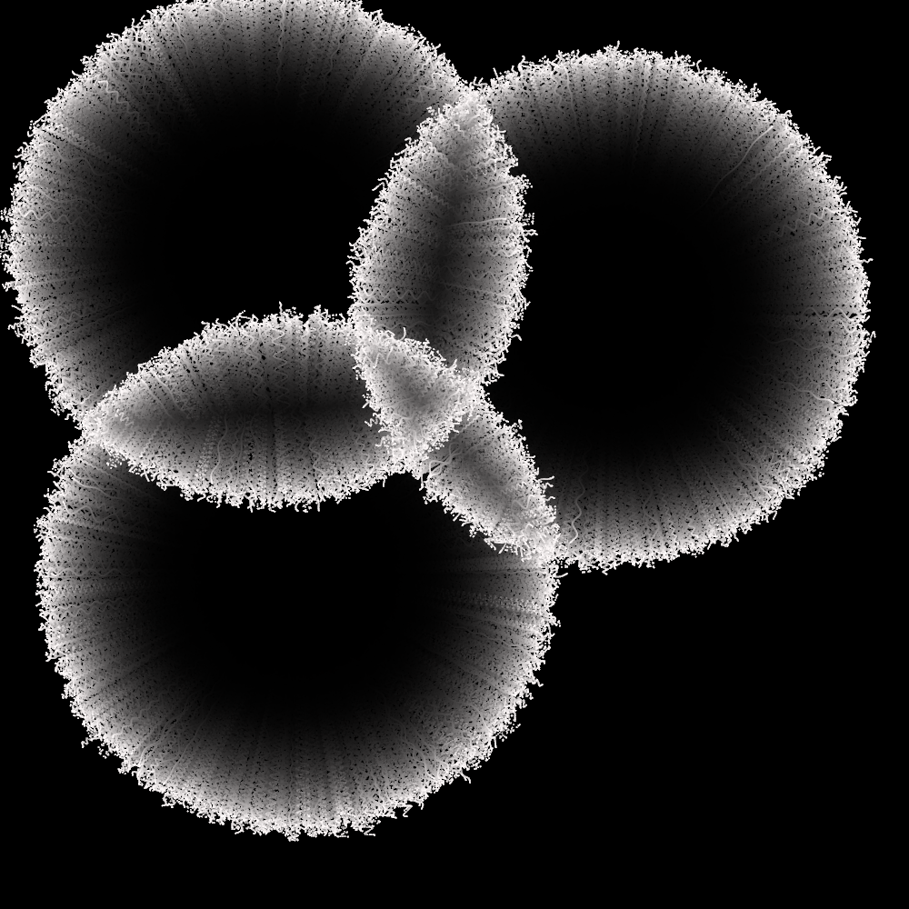
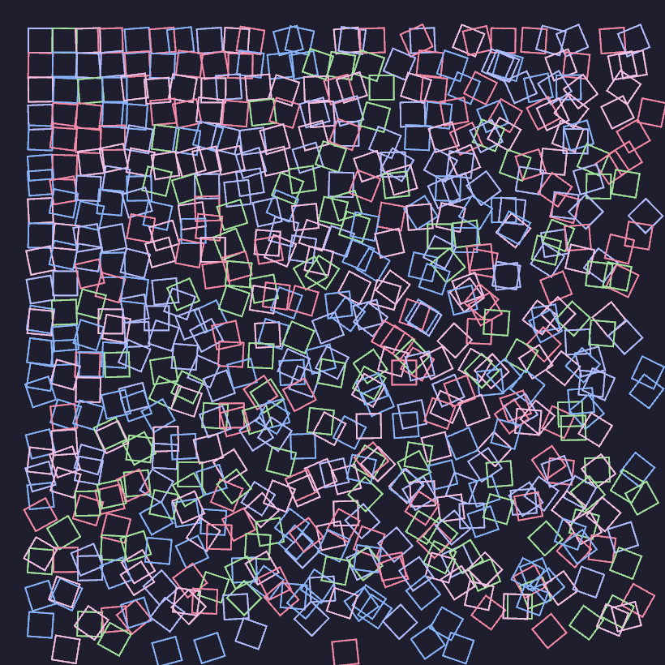

# SLaGrave's Nannou Workspace

A place for my Nannou projects to live.

## [flower](./flower/)

## [promise](./promise/)

## [catppuccin-schotter](./catppuccin-schotter/)

After working through the *Schotter Four Ways* tutorial (see below), I decided to try to mess with it and also split some of the code into other modules.

## sidwellr-schotter directory

I followed along [sidwellr](https://github.com/sidwellr)'s excellent [schotter](https://github.com/sidwellr/schotter) tutorial.

